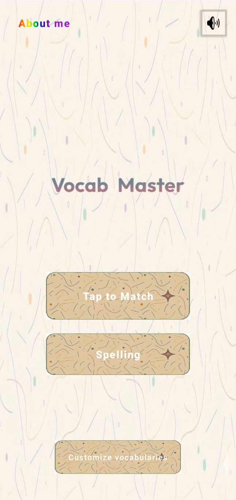
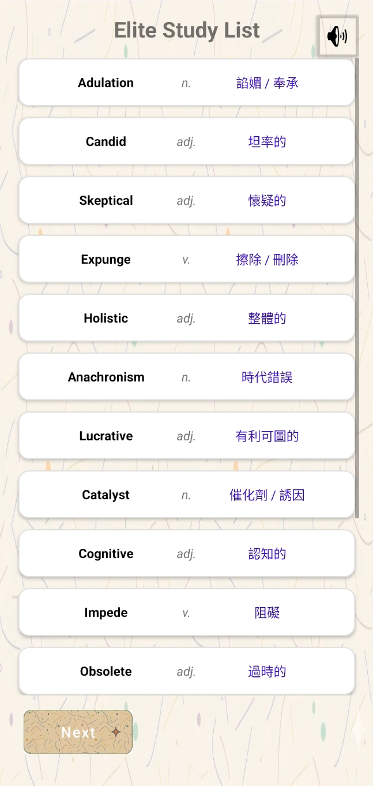
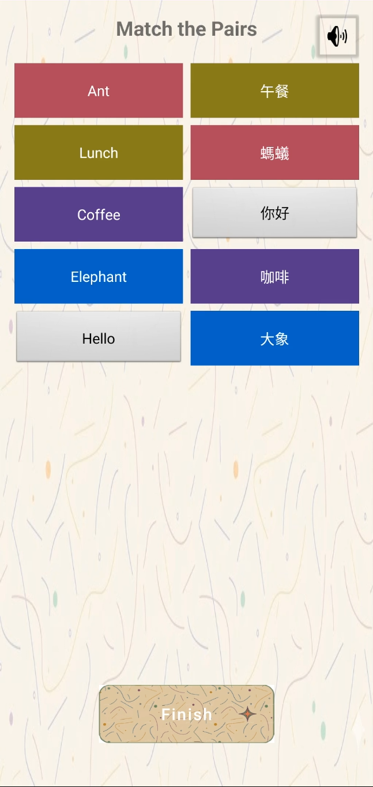
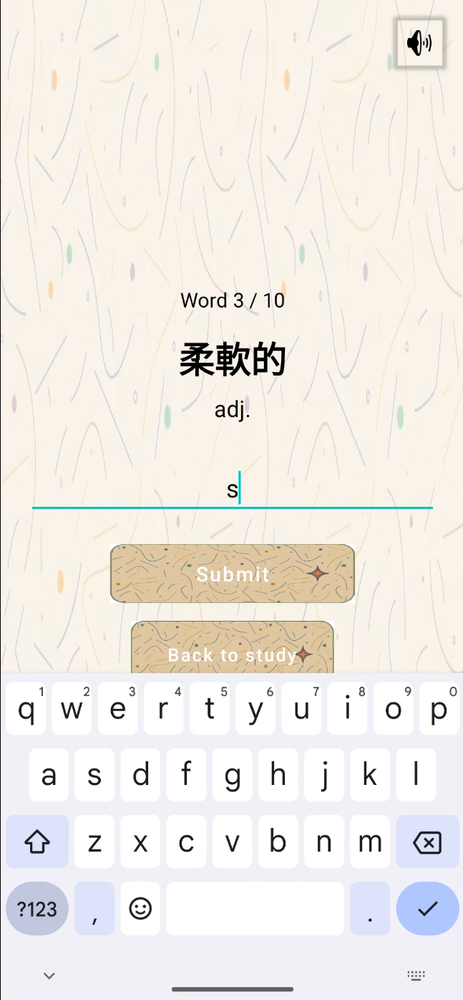
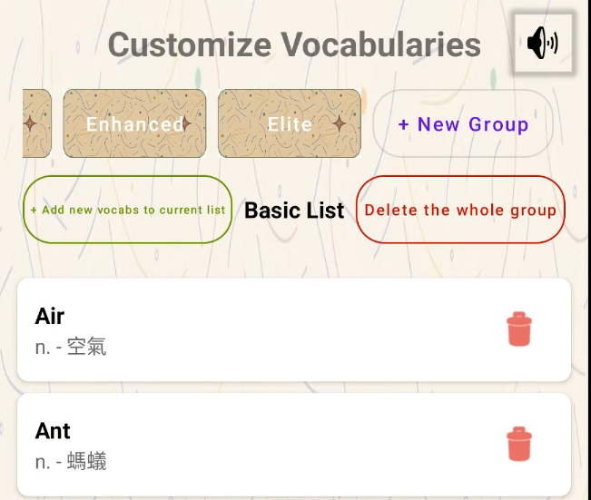

> [English](README.md) | **繁體中文**

# Vocab Master

> **一套 Android 單字訓練 App，填補「辨認」與「回想」之間的落差。**
> 建立自己的單字清單，以閃卡方式溫習，再用配對或拼寫證明自己真正記得。

[](https://github.com/wong060404/vocab-master/actions/workflows/ci.yml)


-4CAF50)


## 畫面截圖

<p align="center">
  
  
  
</p>
<p align="center">
  
  
</p>

---

## 目錄

- [畫面截圖](#畫面截圖)
- [關於本專案](#關於本專案)
- [功能特色](#功能特色)
- [畫面與導覽流程](#畫面與導覽流程)
- [技術棧](#技術棧)
- [架構](#架構)
- [專案結構](#專案結構)
- [資料庫結構](#資料庫結構)
- [內建詞彙](#內建詞彙)
- [開始使用](#開始使用)
- [如何使用本 App](#如何使用本-app)
- [設計決策](#設計決策)
- [測試](#測試)
- [已知限制與未來工作](#已知限制與未來工作)
- [課程背景](#課程背景)
- [致謝](#致謝)
- [授權條款](#授權條款)

---

## 關於本專案

**Vocab Master** 是一套由單一開發者完成的 Android 應用程式，用來學習附有中文釋義的英文單字。它的起點是一個非常實際的觀察 —— 來自作者兼職補習時的第一手經驗：

> 一般語言學習 App 之所以不管用，是因為內容**固定**。它們既無法針對個別學生的「弱項」調整，
> 也無法對應學校下週測驗實際要考的單字表。

Vocab Master 把這件事反過來做。它不提供一份僵化的單字表，而是把主導權交到
**老師 / 學習者**手上：

| 原則 | 在 App 中的體現 |
| --- | --- |
| **以自訂換取效率** | 補習導師可以在**自訂模式（Customize Mode）**中，用幾分鐘輸入一整週的詞彙。 |
| **由辨認到回想** | 兩種截然不同的模式：*點按配對*（聯想）與*拼寫*（主動產出）。 |
| **先溫習，後測驗** | 使用流程刻意編排為 `Select → Study → Test`，鼓勵在提取練習之前先完成短期記憶編碼。 |
| **可持續保存的個人字典** | 本機的 **Room（SQLite）** 資料庫把每個內建及使用者自建的單字永久留在裝置上。 |
| **多感官投入** | 視覺提示、顏色編碼回饋、背景音樂與觸覺輸入（點按與打字）。離線優先 —— 不用帳號、不用網路。 |

### 目標使用者

- **教育工作者與補習導師** —— 需要發布配合學校課程或考試的精選詞彙表。
- **語言學習者** —— 想用更有趣、壓力更小的方式掌握英文單字與其中文意思的中小學生。
- **自主學習者** —— 建立專門清單（商業英語、旅遊短句、考試準備）並希望有系統地檢驗進度的人。

---

## 功能特色

### 兩種學習模式

**點按配對（辨認）**
- 英文單字會被隨機打散排到左欄，中文意思排到右欄。
- 先點一個英文單字，再點它的中文意思 —— 配對成功的一組會以**隨機產生的顏色**鎖在一起。
- 重新選取單字會清除它舊的配對，所以出錯永遠可以補救。
- 按 **Finish** 驗證：正確的配對閃**綠色**，錯誤的閃**紅色**，之後版面會重置讓你再試一次。
- 全對的一輪會前往慶祝畫面。

**拼寫測驗（主動回想）**
- 顯示中文意思與詞性作為提示。
- 使用者必須輸入完全正確的英文拼寫。
- 進度指示（`Word 3 / 10`）加上即時的 *Correct! / Wrong! Try again.* toast 回饋。
- 完成每一個單字後會前往成功畫面。

### 自訂模式（本 App 的核心）

- **內建群組** —— `Basic`、`Enhanced`、`Elite`（寫死在程式中，無法刪除）。
- **可建立無限個自訂群組** —— 例如 *Food*、*Business*、*Travel*、*Week 5 Quiz*。
- **動態產生介面** —— 群組篩選按鈕是在執行時，依照資料庫中不重複的 difficulty 值建立出來的。老師新增內容時，介面就真的跟著長大。
- **新增詞彙**：透過一個簡潔的對話框輸入英文 + 詞性 + 中文。
- **刪除單個單字**，或刪除整個群組，兩者都有 `AlertDialog` 確認保護。
- 每份清單都以 A→Z 排序顯示在 `RecyclerView` 中，每列附有一個刪除按鈕。

### 介面與使用體驗（UI / UX）

- **卡片式溫習模式** —— 置中的 `MaterialCardView` 風格列模擬實體閃卡；水平權重讓英文、詞性與中文整齊對齊。
- 到處都用**會自動縮放字級的 Material Button**，所以再長的學術詞彙也不會在小手機或平板上被裁切或換行。
- **一致的主題** —— 共用 `default_bg` 背景、自訂標誌、圓形漸層按鈕。
- *About the APP* 按鈕上有**彩虹漸層 shader**，是作者個人的創意點綴。

### 多媒體

- 四段循環播放的背景音樂：主頁、溫習、測驗與難度選擇。
- 成功畫面會有拍手音效。
- **靜音切換**固定在每個主要畫面的右上角 —— 可在*不*動到系統音量的情況下讓 App 靜音。
- 音樂會在 `onPause()` 自動暫停，並在 `onResume()` 恢復播放。
- 載入畫面使用**兩個同時播放的 Lottie** 向量動畫。

---

## 畫面與導覽流程

```
                        ┌──────────────────┐
                        │  LoadingActivity │  ← 啟動畫面（2 個 Lottie 動畫）
                        └────────┬─────────┘
                                 │ 延遲 3 秒
              ┌──────────────────┴───────────────────┐
       沒有 DIFFICULTY extra                  DIFFICULTY extra
              │                                      │
              ▼                                      ▼
     ┌─────────────────┐                     ┌────────────────┐
     │  MainActivity   │                     │ StudyActivity  │
     │   （主選單）    │                     │ （清單預覽）   │
     └───┬───┬───┬─────┘                     └───────┬────────┘
         │   │   │                                     │
  點按   │   │   │ 自訂單字               ┌────────────┴─────────────┐
  配對   │   │   └──────────────┐   MODE=SPELLING             MODE=MATCHING
         │   │ 拼寫             ▼         │                          │
         │   │            ┌───────────────┴──────┐          ┌────────┴────────┐
         │   │            │ CustomizeActivity    │          │  QuizActivity   │
         │   │            │ （新增 / 刪除單字）  │          │ （點按配對）    │
         │   │            └──────────────────────┘          └────────┬────────┘
         ▼   ▼                                                      │ 全部正確
 ┌───────────────────────┐   ┌──────────────────────────┐           │
 │ TapMatchChooseActivity│   │ SpellingChooseActivity   │           │
 │  Basic / Enhanced /   │   │  Basic / Enhanced /      │           │
 │  Elite / Custom ▾     │   │  Elite / Custom ▾        │           │
 └───────────┬───────────┘   └────────────┬─────────────┘           │
             │                            │                         │
             └────────► LoadingActivity ◄─┘                         │
                            │                                       │
                            ▼                                       │
                    ┌────────────────┐                              │
                    │ StudyActivity  │                              │
                    └───────┬────────┘                              │
                            │ 開始測驗 / 開始拼寫                   │
                            ▼                                       │
                 ┌────────────────────────┐                         │
                 │ SpellingQuizActivity   │                         │
                 └───────────┬────────────┘                         │
                             │ 全部單字完成                         │
                             ▼                                     ▼
                        ┌──────────────────────────────┐
                        │      SuccessActivity         │
                        │  （拍手音效 + 返回主頁）     │
                        └──────────────────────────────┘

  MainActivity ──► AboutThisAppActivity   （關於 / 使用說明，可捲動）
```

`LoadingActivity` 同時身兼**啟動畫面（splash screen）**與**路由中樞**：如果它收到
`DIFFICULTY` extra，就會直接轉往 `StudyActivity`，否則開啟主選單。

---

## 技術棧

| 層 | 技術 |
| --- | --- |
| 語言 | **Java 11**（source/target compatibility 1.11） |
| IDE / 建置 | Android Studio · **Gradle 9.1.0** · Android Gradle Plugin **9.0.1**（Kotlin DSL + version catalog） |
| Min / Target / Compile SDK | **34 / 35 / 35** |
| Application ID | `com.example.vocab_master_mad_project` |
| 介面 | XML layouts、`AppCompatActivity`、**Material Components 1.13.0**、`RecyclerView`、`AlertDialog`、`Spinner` |
| 持久化（persistence） | **Room 2.6.1**（`room-runtime` + 透過 `annotationProcessor` 引入 `room-compiler`），底層為 SQLite |
| 動畫 | **Lottie 6.7.1**（`com.airbnb.android:lottie`） |
| 媒體 | `android.media.MediaPlayer` 搭配 raw MP3 資源 |
| 測試 | JUnit 4.13.2、AndroidX Test Ext JUnit 1.3.0、Espresso 3.7.0 |
| AndroidX | `appcompat` 1.7.1，`core`/`activity` 由 AGP 預設帶入 |

### 相依套件（`gradle/libs.versions.toml`）

```toml
appcompat      = "1.7.1"
material       = "1.13.0"
lottie         = "6.7.1"
room           = "2.6.1"
junit          = "4.13.2"
junitVersion   = "1.3.0"   # androidx.test.ext:junit
espressoCore   = "3.7.0"
agp            = "9.0.1"
```

---

## 架構

專案採用**受 Repository 啟發的分層模式（Repository-inspired, layered pattern）**，關注點分離清楚，
因此介面程式碼永遠不會直接跟 SQLite 溝通。

```
┌───────────────────────────────────────────────────────────────┐
│  PRESENTATION LAYER  (Activities + XML layouts + Adapters)    │
│                                                               │
│  LoadingActivity   MainActivity   StudyActivity               │
│  TapMatchChooseActivity   SpellingChooseActivity              │
│  QuizActivity   SpellingQuizActivity   CustomizeActivity      │
│  SuccessActivity   AboutThisAppActivity                       │
│                                                               │
│  VocabAdapter (manage list)   GroupAdapter (group chooser)     │
└───────────────────────────┬───────────────────────────────────┘
                            │  Java method calls (no SQL here)
┌───────────────────────────▼───────────────────────────────────┐
│  DOMAIN / REPOSITORY LAYER                                    │
│                                                               │
│  VocabManager   — singleton façade                            │
│    • getAllVocabs() / getAllGroups()                          │
│    • getRandomVocabs(difficulty[, count])                     │
│    • getSortedVocabs(difficulty)                              │
│    • addVocab() / deleteVocab() / deleteGroup()               │
│    • seedDatabaseIfEmpty()                                    │
└───────────────────────────┬───────────────────────────────────┘
                            │
┌───────────────────────────▼───────────────────────────────────┐
│  DATA LAYER                                                   │
│                                                               │
│  VocabDao (Room @Dao interface)                               │
│  AppDatabase (Room @Database singleton, DB "vocab_database")  │
│  Vocab (Room @Entity, table "vocabs", Serializable)           │
└───────────────────────────────────────────────────────────────┘
```

**重點**

- `AppDatabase` 是執行緒安全的單例（`getInstance(Context)`），建立時使用
  `fallbackToDestructiveMigration()` 與 `allowMainThreadQueries()` —— 後者是針對這種課業規模的 App
  刻意做的簡化；正式產品版本應該把查詢移到背景執行器（見[未來工作](#已知限制與未來工作)）。
- `VocabManager` 同樣是單例，並由 `LoadingActivity` **最先**初始化，確保在任何其他畫面開啟
  之前，schema 已經存在、種子資料也已就緒。
- `Vocab implements Serializable`，這讓整份打散後的測驗清單能以 `Intent` extra（`QUIZ_LIST`）
  的形式，從 `StudyActivity` 交給 `QuizActivity` / `SpellingQuizActivity`。
- 測驗題數由 `VocabManager.getRandomVocabs()` 決定：
  `Basic → 5`、`Enhanced → 10`、`Elite → 15`，而**自訂群組會拿到全部單字並隨機打散**。
  拼寫模式每回則固定使用 **10** 個單字。

---

## 專案結構

```
Vocab_Master_V1.0/
├── build.gradle.kts                 # root build script
├── settings.gradle.kts              # rootProject.name = "Vocab_Master_mad_project"
├── gradle.properties
├── gradlew / gradlew.bat
├── README.md                        # this file
├── docs/                            # course deliverables (addendum)
│   ├── MAD_Vocab_Master.pptx        # presentation slides
│   └── VocabMaster.apk              # compiled, installable build
├── gradle/
│   ├── libs.versions.toml           # version catalog (AGP, Room, Lottie, Material…)
│   └── wrapper/gradle-wrapper.properties   # Gradle 9.1.0
└── app/
    ├── build.gradle.kts             # app module: compileSdk 35, minSdk 34, Java 11
    ├── proguard-rules.pro
    └── src/
        ├── main/
        │   ├── AndroidManifest.xml          # LoadingActivity is the LAUNCHER
        │   ├── ic_launcher-playstore.png
        │   ├── java/com/example/vocab_master_mad_project/
        │   │   ├── AppDatabase.java          # Room database singleton
        │   │   ├── VocabDao.java             # Room DAO (CRUD + filters)
        │   │   ├── Vocab.java                # @Entity "vocabs"
        │   │   ├── VocabManager.java         # repository + 800-word seeder
        │   │   ├── VocabAdapter.java         # RecyclerView adapter (manage list)
        │   │   ├── GroupAdapter.java         # RecyclerView adapter (group chooser)
        │   │   ├── LoadingActivity.java      # splash + routing
        │   │   ├── MainActivity.java         # home menu, BGM, rainbow shader
        │   │   ├── StudyActivity.java        # flashcard list preview
        │   │   ├── QuizActivity.java         # Tap to Match game
        │   │   ├── SpellingChooseActivity.java
        │   │   ├── SpellingQuizActivity.java # typing quiz
        │   │   ├── TapMatchChooseActivity.java
        │   │   ├── CustomizeActivity.java    # full CRUD UI
        │   │   ├── SuccessActivity.java      # celebration + clapping SFX
        │   │   └── AboutThisAppActivity.java
        │   └── res/
        │       ├── drawable/     # default_bg, button_default, logo, me, launcher vectors
        │       ├── layout/       # 16 XML layouts (activities, dialogs, list items)
        │       ├── mipmap-*/     # adaptive launcher icons (all densities)
        │       ├── raw/          # loading.json, loading2.json, 5 × .mp3 audio
        │       ├── values/       # colors.xml, strings.xml, themes.xml (+ values-night)
        │       └── xml/          # backup_rules.xml, data_extraction_rules.xml
        ├── test/java/.../ExampleUnitTest.java
        └── androidTest/java/.../ExampleInstrumentedTest.java
```

**值得留意的 layout 檔案**

| 檔案 | 用途 |
| --- | --- |
| `activity_loading.xml` | 兩個 `LottieAnimationView`（中央 300dp、右下 150dp） |
| `activity_main.xml` | 標誌、模式按鈕、Customize 按鈕、About 按鈕、靜音切換 |
| `activity_study.xml` + `item_vocab_study.xml` | 閃卡清單 |
| `activity_quiz.xml` + `item_quiz_box.xml` | 雙欄配對版面 |
| `activity_spelling_quiz.xml` | 提示文字 + 輸入欄位 + 提交 |
| `activity_customize.xml` | 群組按鈕列、`RecyclerView`、新增／建立／刪除按鈕 |
| `dialog_add_vocab.xml` | 英文 / 詞性 / 中文輸入對話框 |
| `dialog_group_chooser.xml` + `item_group_select.xml` | 自訂群組選擇對話框 |
| `about_this_app.xml` | 可捲動的 About + How-to-use 畫面 |

---

## 資料庫結構

**資料庫名稱：** `vocab_database` · **版本：** `1` · **資料表：** `vocabs`

| 欄位 | 型別 | 條件約束 | 備註 |
| --- | --- | --- | --- |
| `id` | `INTEGER` | `PRIMARY KEY AUTOINCREMENT` | 由 Room 產生 |
| `english` | `TEXT` | `NOT NULL`（`@NonNull`） | 單字本身 |
| `pos` | `TEXT` | 可為 null | 詞性 —— `n.`、`v.`、`adj.`、`adv.`、`prep.`、`num.`、`int.` |
| `chinese` | `TEXT` | 可為 null | 中文意思 / 翻譯 |
| `difficulty` | `TEXT` | 可為 null | **群組名稱**：`Basic`、`Enhanced`、`Elite`，或任何使用者建立的名稱 |

**`VocabDao` 的操作**

```java
List<Vocab>  getAllVocabs();                        // ORDER BY english ASC
List<Vocab>  getVocabsByDifficulty(String group);   // ORDER BY english ASC
List<String> getAllGroups();                        // SELECT DISTINCT difficulty
void insert(Vocab v);
void insertAll(List<Vocab> v);
void update(Vocab v);
void delete(Vocab v);
void deleteById(int id);
void deleteGroupByDifficulty(String group);
```

### 動態群組系統

這裡**沒有獨立的 `groups` 資料表**。一個群組*就是*共用同一個 `difficulty` 值的那組資料列，
而 UI 是靠 `SELECT DISTINCT difficulty` 填充的：

1. `CustomizeActivity` 呼叫 `VocabManager.getAllGroups()`。
2. 任何不是 `Basic` / `Enhanced` / `Elite` 的名稱，都會得到一個動態建立的 `MaterialButton`。
3. 點那個按鈕就只是用該字串做篩選 —— 因此內建群組與自訂群組，在溫習與測驗引擎眼中是
   **完全同等**的。
4. 刪除群組就是一句 `DELETE FROM vocabs WHERE difficulty = :name`。

這三個內建名稱是在 UI 層受到保護的（`confirmDeleteGroup()` 會拒絕刪除），這也是它們被描述為
*寫死在程式中、無法在 App 內刪除的預設值*的原因。

---

## 內建詞彙

首次啟動時，`VocabManager.seedDatabaseIfEmpty()` 會把 **800 個單字**寫入資料庫
（只在資料表為空時執行，所以使用者的修改永遠不會被覆蓋）：

| 群組 | 單字數 | 每回測驗題數 |
| --- | --- | --- |
| **Basic** | 250 | 5 |
| **Enhanced** | 270 | 10 |
| **Elite** | 280 | 15（自訂群組則為全部單字） |

單字按主題分批，每批之內大致依字母排序 —— 例如 Basic 的
*身體與健康、衣著、食物與飲品、動物與昆蟲、自然與地點、家居用品、常見動作、形容詞、時間／數字／人物*；
Enhanced 的 *商業與專業、職場與任務、科學與科技、自然與環境、社會與心智、抽象與度量*；
Elite 則是語域較高的詞彙，例如 *ubiquitous、meticulous、exacerbate、quintessential* 這一類詞條。

---

## 開始使用

### 先決條件

- **Android Studio**（建議 Ladybug 或更新版本 —— AGP 9.0.1 / Gradle 9.1.0）
- **JDK 11** 或更新版本
- 一部執行 **Android 14（API 34）** 或更新版本的裝置 / 模擬器 —— `minSdk = 34`

### 建置與執行

```bash
# 1. Clone
git clone https://github.com/<your-username>/Vocab_Master_V1.0.git
cd Vocab_Master_V1.0

# 2. Build a debug APK (Linux / macOS)
./gradlew assembleDebug

#    …or on Windows
gradlew.bat assembleDebug

# 3. Install on a connected device / running emulator
./gradlew installDebug
```

然後用 Android Studio 開啟專案並按 **Run ▶**，或手動安裝
`app/build/outputs/apk/debug/app-debug.apk`。

> **注意** —— `local.properties`（內含你的 SDK 路徑）刻意**不**納入版控；Android
> Studio 首次開啟時會重新產生它。不需要任何 API key、帳號或網路連線：本 App
> 完全離線。

### 正式版（Release）建置

```bash
./gradlew assembleRelease
```

目前**關閉**了程式碼縮減（`isMinifyEnabled = false`），而且 release build 並未簽章 ——
發布到 Google Play 之前，請先設定你自己的簽章設定。

---

## 如何使用本 App

### 1. 建立你自己的單字群組

1. 在主畫面點按 **Customize vocabularies**。
2. 點 **+ New Group** 並輸入名稱 —— 可以按主題（`Food`、`Travel`、`Science`）或按時間表
   （`Week 5 Quiz`）。
3. 新的群組按鈕會立即出現在篩選列中。

### 2. 加入你的單字

1. 選取你想填入內容的群組。
2. 點 **Add**，在對話框中填寫：**English**、**Part of Speech**、**Chinese**。
3. 單字會立即寫入，排序後的清單也會重新整理。

### 3. 溫習

1. 主頁 → **Tap to Match** 或 **Spelling**。
2. 選擇難度：**Basic**、**Enhanced**、**Elite**，或選 **Custom ▾** 進入你自己的群組。
3. 隨機抽樣時，會出現一段簡短的動畫載入畫面。
4. 瀏覽閃卡清單。準備好時點按 **Start quiz** / **Start spelling**。

### 4. 自我測驗

- **Tap to Match** —— 點一個英文單字（它會變成藍色），再點對應的中文意思。配對成功的一組會
  鎖上同一種顏色。全部配對完成後按 **Finish**；綠色 = 正確，紅色 = 錯誤。
  任何錯誤都會在片刻後重置版面，讓你可以再試一次。
- **Spelling** —— 依照顯示的中文意思輸入英文單字。答對會自動前進；
  答錯可以重試（`Text is re-selected for a quick retype`）。

### 5. 慶祝並重複

全部完美完成後，會開啟 **Success** 畫面並播放拍手音效。回到主頁，每天都來 ——
反覆溫習同一個群組，正是讓單字從短期記憶進入長期記憶的既定做法。

### 6. 管理你的資料

- **刪除單個單字：** 點該列的垃圾桶圖示 → 確認。
- **刪除整個群組：** 選取它，點刪除群組按鈕 → 確認。
  *（內建群組受保護，無法刪除。）*

---

## 設計決策

| 決策 | 理由 |
| --- | --- |
| **兩種截然不同的測驗模式** | 配對練的是*辨認*，打字練的是*產出*。認識一個字，代表你能寫得出來，而不只是認得出來。 |
| **每次測驗前都強制經過溫習階段** | `Select → Study → Test` 鼓勵在提取之前先完成編碼，對記憶保留有可量度的幫助。 |
| **用本機 Room 資料庫，而不是記憶體中的清單** | 個人化字典必須在 App 重啟後仍然存在；Room 還提供經編譯期檢查的查詢與自動遷移。 |
| **重複用 `difficulty` 字串當作群組名稱** | 省掉第二張表與一次 join；「動態群組系統」因此能一視同仁地對待內建與自訂群組。 |
| **Tap to Match 的配對顏色隨機產生** | 顏色成為額外的記憶錨點，也讓正確／錯誤的回饋一眼可辨。 |
| **使用 AlertDialog 確認** | 刪除群組是破壞性操作；多一步確認可避免整份精心整理的清單意外消失。 |
| **Material Button 自動縮放字級** | 冗長的學術詞彙絕不能被裁切或換行 —— 這讓版面從小型手機到平板都保持專業。 |
| **每個畫面都有靜音切換** | 讓容易分心的使用者可以關掉聲音，而不必調整裝置的系統音量。 |
| **在 `LoadingActivity` 初始化單例 `VocabManager`** | 保證在任何讀取資料的畫面出現之前，資料庫與種子資料都已就緒。 |

---

## 測試

專案附有標準的 instrumented test / 單元測試（unit test）框架：

- `app/src/test/java/.../ExampleUnitTest.java` —— 單純的 JUnit 4。
- `app/src/androidTest/java/.../ExampleInstrumentedTest.java` —— Espresso / AndroidJUnitRunner。

```bash
./gradlew test              # local unit tests
./gradlew connectedAndroidTest   # instrumented tests (device/emulator required)
```

**已執行的手動測試**聚焦在持久化層與 CRUD 流程：在乾淨安裝上驗證種子資料、新增／刪除個別
單字、建立與刪除自訂群組，以及確認自訂群組在兩種測驗模式中都正確出現。開發與測試都在
Android Studio 上進行，使用**執行 Android 14（API 34）的虛擬裝置**與 `compileSdk = 35`。

---

## 已知限制與未來工作

以下是目前版本誠實而刻意的界線：

- **啟用了 `allowMainThreadQueries()`。** 對課業專案來說很簡單，但在清單很大時會阻塞 UI 執行緒。
  *下一步：* 把 Room 存取移到 `ExecutorService`，並提供 `LiveData`/`Flow`。
- **沒有間隔重複（spaced repetition）排程。** 單字是均勻隨機抽出的。導入 Leitner box / SRS
  模型，會更有效率地針對弱項單字。
- **拼寫答案以 `equalsIgnoreCase` 比對。** 沒有模糊比對，所以錯一個字母就算錯；而且拼寫題庫
  每回上限為 10 個單字。
- **Tap-to-Match 版面是用字串比對英文，而不是用資料列 id** —— 同一群組內若有重複的英文單字，
  可能會一起被標記成選取狀態。
- **`fallbackToDestructiveMigration()`** 會在 schema 變更時清空資料。正式發布更新之前，
  需要有真正的遷移策略。
- **沒有匯入／匯出。** 補習導師目前還無法把整理好的群組分享到另一部裝置 —— CSV 或 JSON
  匯入／匯出是價值最高的下一個功能。
- **只有兩個 UI 測試骨架。** 針對 `VocabManager` 的測驗題數與洗牌規則補上單元測試，
  會是便宜又高價值的補充。
- **音訊與圖片都打包在 APK 內。** 把它們移到網路或可下載的資源包，可以縮小安裝體積。

---

## 課程背景

Vocab Master 是以下課程的**最終專案（Final Project）**：

| | |
| --- | --- |
| **課程** | Mobile Application Development (MAD) |
| **課程編號 / 學期** | CCIT 4059, 2025–2026 Semester 2 |
| **專案類型** | 個人課程專案（Android 應用程式） |
| **作者** | Wong Chun Cheung |
| **開發平台** | Android Studio、Java |

課程的交付項目還包括一份專案文件報告、簡報投影片、示範影片，以及編譯好的 APK。

### AI 工具使用聲明

依據課程的使用聲明要求，以下內容公開說明：

- **使用的工具：** Google **Gemini**。
- **使用範圍：** 在開發 App 期間作為助手與老師 —— 例如**除錯**，以及學習如何在 App 內
  **管理資料庫**（Room）。
- **AI 產生的內容：** **預設（種子）詞彙清單**是在 AI 協助下產生的，之後經審閱才納入。

應用程式的邏輯、功能設計與 UI 實作，仍然是作者本人的作品。

---

## 致謝

- [AndroidX](https://developer.android.com/jetpack/androidx) 與 [Material Components for Android](https://github.com/material-components/material-components-android)
- [Room Persistence Library](https://developer.android.com/training/data-storage/room)
- [Airbnb Lottie for Android](https://github.com/airbnb/lottie-android) —— 載入動畫
- 課程教學團隊提供 MAD 專案簡介與指導

---

## 授權條款

以 **MIT License** 發布 —— 詳見 [`LICENSE`](LICENSE) 檔案。

```
Copyright (c) 2026 Wong Chun Cheung
```

> 如果你重用這個專案，請保留署名，並註明隨附的詞彙與音訊素材是為學術課業而製作的。

---

<p align="center"><i>今天就開始你的學習旅程，成為 Vocab Master！</i></p>
